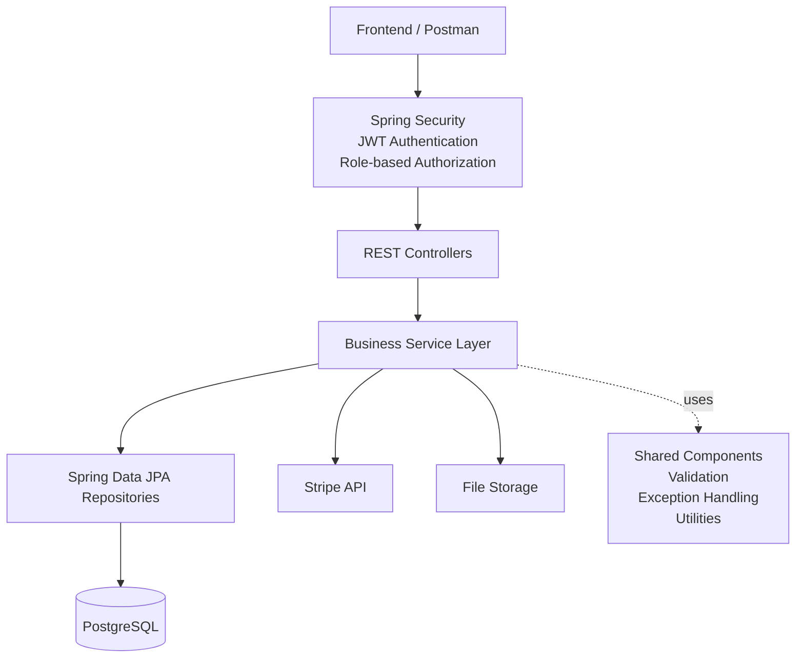
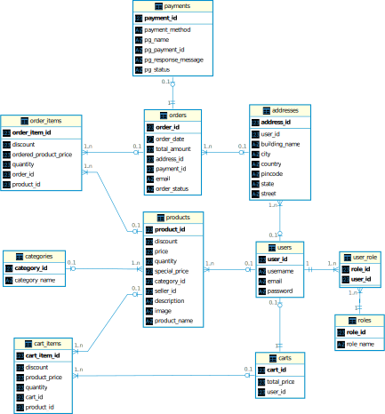
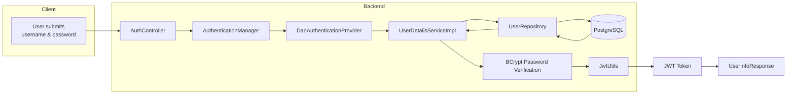
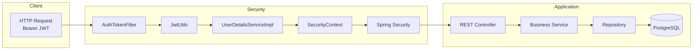
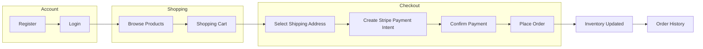
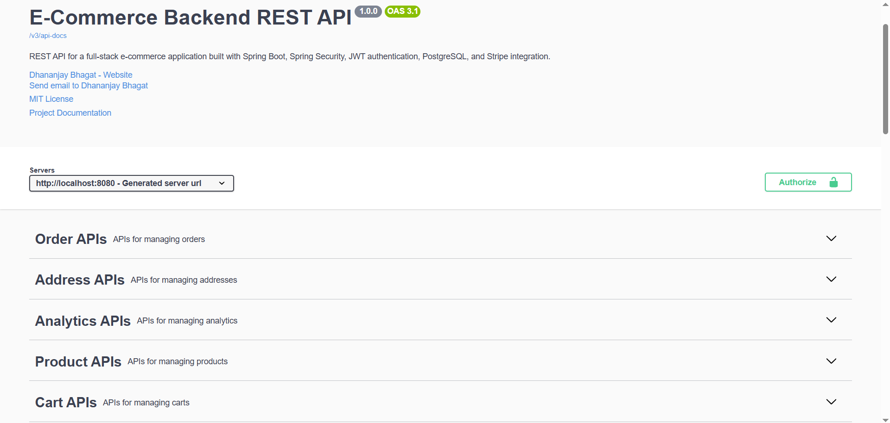
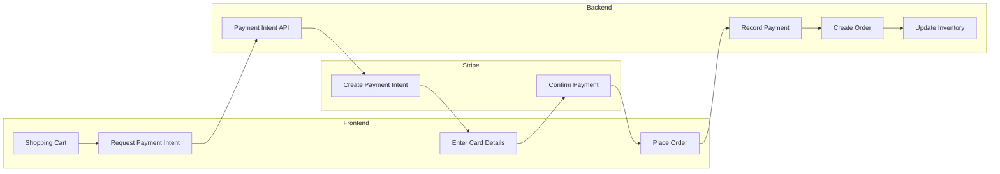
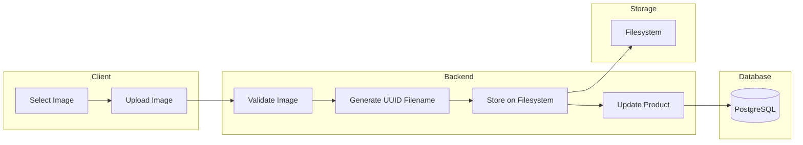

# Ecommerce Backend API

A production-style RESTful backend built with Spring Boot for a multi-role e-commerce platform, featuring JWT authentication, role-based authorization, product management, shopping cart, Stripe payments, image uploads, and comprehensive automated testing.


---

Ecommerce Backend API is a Spring Boot application that serves as the backend of an online shopping platform. It provides secure authentication and authorization using JSON Web Tokens (JWT), supports multiple user roles (Admin, Seller, and Customer), and offers product catalog, shopping cart, address, and order management. The application also integrates Stripe for secure online payments, supports image uploads for products, and follows a layered, service-oriented architecture with comprehensive validation, exception handling, and extensive unit and integration testing.

## Quick Navigation

- [Overview](#overview)
- [Features](#features)
- [Tech Stack](#tech-stack)
- [Architecture](#architecture)
- [Project Structure](#project-structure)
- [Database Design](#database-design)
- [Authentication & Authorization](#authentication--authorization-1)
- [Application Flow](#application-flow)
- [API Documentation](#api-documentation)
- [Installation](#installation)
- [Configuration](#configuration)
- [Running the Application](#running-the-application)
- [Running Tests](#running-tests)
- [Stripe Integration](#stripe-integration)
- [Image Upload](#image-upload)
- [Testing Strategy](#testing-strategy)
- [Future Improvements](#future-improvements)
- [Contributing](#contributing)
- [License](#license)
- [Acknowledgements](#acknowledgements)

## Overview

Ecommerce Backend API is the backend of a modern e-commerce platform built using Spring Boot. The project is designed with a strong emphasis on clean architecture, separation of concerns, maintainability, and automated testing.

The codebase follows a layered, service-oriented design that separates business logic, data access, API contracts, and cross-cutting concerns into dedicated components. This approach keeps the application modular, easier to maintain, and straightforward to extend as new features are introduced.

The following sections explore the application's features, architecture, security, database design, testing strategy, and implementation details.

## Features

### Product Catalog Management

* Create, update, retrieve, and delete products and categories
* Product image upload with automatic URL generation
* Inventory management with quantity tracking
* Product listing with pagination, sorting, and filtering support

### Shopping Experience

* Shopping cart management
* Customer address management
* Order placement and order history
* Checkout workflow with order validation

### Authentication & Authorization

* User registration and login using JWT authentication
* Role-based access control for **Admin**, **Seller**, and **Customer**
* Password encryption using BCrypt
* Protected REST endpoints using Spring Security

### Payment Integration

* Secure online payment processing using Stripe
* Order payment workflow integrated with the checkout process

### API Design

* RESTful API following layered, service-oriented architecture
* DTO-based request and response models
* Centralized exception handling with consistent error responses
* Request validation using Jakarta Bean Validation
* Pagination and sorting support for REST endpoints
* OpenAPI (Swagger) documentation for API exploration

### Quality & Testing

* Comprehensive unit testing using JUnit 5 and Mockito
* Integration testing for API and business workflows
* Structured logging for easier debugging and monitoring
* Clean package organization with separation of concerns

## Tech Stack

| Category              | Technology                 | Usage                                       |
| --------------------- |----------------------------|---------------------------------------------|
| **Language**          | Java 21                    | Primary programming language                |
| **Framework**         | Spring Boot 4.x            | Core backend framework                      |
| **Web**               | Spring MVC                 | REST API development                        |
| **Security**          | Spring Security, JWT       | Authentication and role-based authorization |
| **Persistence**       | Spring Data JPA, Hibernate | ORM and repository abstraction              |
| **Database**          | PostgreSQL                 | Relational database                         |
| **Validation**        | Jakarta Bean Validation    | Request validation                          |
| **API Documentation** | Swagger / OpenAPI          | Interactive REST API documentation          |
| **Payment Gateway**   | Stripe                     | Secure online payment processing            |
| **Build Tool**        | Maven                      | Dependency management and project build     |
| **Testing**           | JUnit 5, Mockito           | Unit and integration testing                |
| **Logging**           | SLF4J, Logback             | Application logging                         |
| **Utilities**         | Lombok                     | Reduces boilerplate code                    |

## Architecture

The Ecommerce Backend API follows a layered, service-oriented architecture that separates request handling, business logic, persistence, security, and infrastructure concerns into dedicated modules. Every incoming request passes through Spring Security for authentication and authorization before reaching the REST controllers. Controllers remain responsible for HTTP request handling and delegate all business operations to the service layer.

The service layer implements the application's core business logic for authentication, product catalog management, shopping cart operations, order processing, payment integration, analytics, and inventory management. Data persistence is handled through Spring Data JPA with PostgreSQL, while shared components provide reusable functionality such as authentication helpers, image URL generation, pagination validation, request validation, and centralized exception handling.



### Application Components

| Component                   | Responsibility                                                                                                                                                                                                                                    |
|-----------------------------|---------------------------------------------------------------------------------------------------------------------------------------------------------------------------------------------------------------------------------------------------|
| **Security Layer**          | Authenticates requests using JWT, authorizes users based on **Admin**, **Seller**, and **Customer** roles, and protects secured endpoints before requests enter the application.                                                                  |
| **REST Controllers**        | Expose REST endpoints for the application's business modules, validate incoming requests, and delegate business operations to the service layer.                                                                                                  |
| **Business Service Layer**  | Implements the application's business logic, including authentication, product catalog management, shopping cart operations, order processing, payment integration, analytics, inventory management, and coordination with supporting components. |
| **Repository Layer**        | Uses Spring Data JPA repositories to perform database operations and custom queries while abstracting persistence logic from the business layer.                                                                                                  |
| **Shared Components**       | Reusable infrastructure including `ImageUrlUtil`, `AuthUtil`, `PaginationValidator`, request validation, and centralized exception handling that is shared across multiple modules.                                                               |
| **Stripe Integration**      | Integrates with the Stripe API to support payment intent creation and payment processing for customer checkout.                                                                                                                                   |
| **File Storage**            | Stores uploaded product images in the application's local file system, while `ImageUrlUtil` generates URLs for accessing those images through the REST API.                                                                                       |
| **Database**                | PostgreSQL stores all application data, including users, roles, products, categories, carts, addresses, orders, payments, and related domain entities.                                                                                            |

## Project Structure

The project is organized using a feature-oriented package structure built on top of a layered architecture. Related components are grouped into dedicated packages, making the codebase easier to navigate, maintain, and extend as new functionality is added.

```text
src
├── main
│   ├── java/com/ecommerce/project
│   │   ├── config/          # Application configuration
│   │   ├── controller/      # REST API endpoints
│   │   ├── exceptions/      # Custom exceptions and global exception handling
│   │   ├── model/           # JPA entities and domain models
│   │   ├── payload/         # Request and response DTOs
│   │   ├── repositories/    # Spring Data JPA repositories
│   │   ├── security/        # JWT authentication and Spring Security
│   │   ├── service/         # Business logic implementation
│   │   ├── util/            # Shared utility classes
│   │   └── SbEcomApplication.java
│   │
│   └── resources/
│       ├── application.properties
│       ├── application-dev.properties
│       ├── application-test.properties
│       └── application-prod.properties
│
└── test
    └── java/com/ecommerce/project
        ├── integration/     # Integration tests
        ├── service/         # Unit tests for service layer
        ├── util/            # Utility class tests
        └── SbEcomApplicationTests.java
```

### Package Organization

| Package | Description |
|---------|-------------|
| **config** | Application configuration including Swagger/OpenAPI, MVC configuration, application constants, and other framework configuration classes. |
| **controller** | REST controllers exposing endpoints for authentication, products, categories, carts, addresses, analytics, and order management. |
| **exceptions** | Custom exception classes and a centralized global exception handler that provides consistent API error responses. |
| **model** | JPA entities representing the application's core domain, including users, products, categories, carts, orders, payments, and related models. |
| **payload** | Request and response DTOs that define the API contract and prevent direct exposure of persistence entities. |
| **repositories** | Spring Data JPA repositories responsible for persistence operations and custom database queries. |
| **security** | Spring Security configuration, JWT authentication, authorization, custom security handlers, and user authentication services. |
| **service** | Implements the application's business logic, including authentication, catalog management, shopping cart operations, order processing, payment integration, analytics, and file management. |
| **util** | Shared helper classes that provide reusable functionality across multiple modules. |
| **resources** | Environment-specific application configuration files and other runtime resources. |
| **test** | Unit and integration tests covering business services, utility classes, and REST API workflows. |

## Database Design

The application uses PostgreSQL as its relational database. The schema is designed around the core e-commerce domain, with normalized entities representing users, products, categories, shopping carts, orders, payments, and addresses. Relationships between these entities maintain data integrity while supporting the application's authentication, catalog management, checkout, and order processing workflows.

### Entity Relationship Diagram

<p align="center">
  
</p>

<p align="center">
  <em>Figure 1. Entity Relationship (ER) diagram of the application's relational database schema.</em>
</p>

### Entity Overview

| Entity | Purpose |
|---------|---------|
| **User** | Stores user account information used for authentication and authorization. Users can act as customers, sellers, or administrators based on their assigned roles. |
| **Role** | Defines the application's authorization roles and supports role-based access control through the `user_role` mapping table. |
| **Category** | Organizes products into logical groups to simplify browsing and product management. |
| **Product** | Represents items available for purchase, including pricing, inventory, seller information, category, and product images. |
| **Cart** | Represents the active shopping cart associated with a customer. |
| **CartItem** | Stores the individual products, quantities, and pricing information contained within a shopping cart. |
| **Address** | Stores shipping addresses associated with users and is referenced during order placement. |
| **Order** | Represents a completed customer purchase, including its status, shipping address, associated payment, and total amount. |
| **OrderItem** | Stores the products purchased within an order along with their quantity, pricing, and applied discounts. |
| **Payment** | Stores payment information including the payment method, Stripe payment intent identifier, transaction details, and payment status for an order. |

## Authentication & Authorization

The application implements stateless authentication using JSON Web Tokens (JWT) together with Spring Security. New users can register through the signup endpoint, after which passwords are securely hashed using BCrypt before being stored in the database. Registered users authenticate by signing in with their credentials, and upon successful authentication the backend generates a signed JWT.

For all protected endpoints, clients include the JWT in the `Authorization` header using the Bearer authentication scheme. Every incoming request passes through a custom JWT authentication filter, where the token is validated and the authenticated user's identity and roles are loaded into the Spring Security context. Access to protected endpoints is then enforced using Spring Security request matchers based on the user's assigned roles. The application supports three user roles: Customer (ROLE_USER), Seller (ROLE_SELLER), and Admin (ROLE_ADMIN).

### Login Flow



### Authenticated Request Flow



### Security Components

| Component | Responsibility |
|-----------|----------------|
| **WebSecurityConfig** | Configures Spring Security, CORS, stateless session management, endpoint authorization rules, authentication provider, password encoder, and JWT filter registration. |
| **AuthTokenFilter** | Intercepts incoming requests, extracts the JWT from the `Authorization` header, validates it, and authenticates the user before the request reaches the controllers. |
| **JwtUtils** | Generates JWTs after successful authentication, validates incoming tokens, extracts usernames, and manages token signing using the configured secret key. |
| **UserDetailsServiceImpl** | Loads user information and assigned roles from the database during authentication. |
| **UserDetailsImpl** | Spring Security implementation of `UserDetails` that represents the authenticated user and exposes granted authorities. |
| **AuthController** | Exposes authentication-related endpoints such as user registration, login, current user information, seller management, and role promotion. |
| **AuthService** | Implements authentication, user registration, JWT generation, seller retrieval, role promotion, and current user operations. |
| **AuthEntryPointJwt** | Returns a standardized `401 Unauthorized` response when authentication fails or a JWT is missing or invalid. |
| **CustomAccessDeniedHandler** | Returns a standardized `403 Forbidden` response when an authenticated user attempts to access a resource without sufficient permissions. |
| **SecurityExceptionHandler** | Converts authentication exceptions such as invalid login credentials into consistent REST API error responses. |

### Role Permissions

| Role | Permissions                                                                                                                                     |
|------|-------------------------------------------------------------------------------------------------------------------------------------------------|
| **Customer** | Register an account, authenticate, browse products, manage the shopping cart, manage addresses, place orders, and view personal order history.  |
| **Seller** | All Customer permissions, plus manage their products, inventory, and customer orders associated with their products.                            |
| **Admin** | Full administrative access, including seller management, user role promotion, analytics endpoints, and all protected administrative operations. |

## Application Flow

The following workflow illustrates the typical lifecycle of a user interacting with the application, from account registration to successful order placement. It highlights how the application's core modules collaborate to provide a complete e-commerce experience.



### Workflow Stages

| Stage                            | Description                                                                                                                                                                 |
|----------------------------------|-----------------------------------------------------------------------------------------------------------------------------------------------------------------------------|
| **User Registration**            | A new user creates an account through the signup endpoint. The password is hashed using BCrypt before being stored, and the default ROLE_USER is assigned to the account.   |
| **User Login**                   | The user authenticates with their credentials. Upon successful authentication, the backend generates a JWT that is used for subsequent authenticated requests.              |
| **Product Browsing**             | Browse products, categories, pricing, inventory, and product images through the catalog APIs.                                                                               |
| **Add Products to Cart**         | Selected products are added to the customer's shopping cart, where quantities can be updated or removed before checkout.                                                    |
| **Manage Shipping Address**      | Create or update shipping addresses that can later be selected during order placement.                                                                                      |
| **Checkout**                     | The application validates the shopping cart, verifies inventory availability, calculates the order total, and prepares the order for payment.                               |
| **Create Stripe Payment Intent** | When using the frontend application, the backend creates a Stripe Payment Intent that is used to securely process the payment.                                              |
| **Confirm Payment**              | After a successful payment, the frontend submits the payment details (including the Payment Intent ID) to the backend as part of the order request.                         |
| **Place Order**                  | The backend validates the payment information, creates the order and order items, stores the payment record, associates the shipping address, and persists the transaction. |
| **Update Inventory**             | The inventory of purchased products is updated to reflect the quantities ordered, ensuring accurate stock levels for future purchases.                                                      |
| **View Order History**           | Users can retrieve their previous orders and view order details and order status through authenticated endpoints.                                                             |

## API Documentation

The project includes interactive API documentation powered by **Springdoc OpenAPI** and **Swagger UI**. Every REST endpoint is documented with its request parameters, request bodies, response schemas, authentication requirements, and HTTP status codes, allowing developers to explore and test the API directly from the browser.

The API documentation is automatically generated from the application's source code and stays synchronized with the implemented REST endpoints.

### Swagger UI

<p align="center">
  
</p>

<p align="center">
  <em>Figure 2. Interactive Swagger UI generated from the application's OpenAPI specification.</em>
</p>

### Features

- Interactive browser-based API explorer
- OpenAPI 3.1 specification generation
- JWT Bearer authentication support
- Request and response schema documentation
- Endpoint grouping by functional module
- Execute API requests directly from the browser

## Installation

Follow the steps below to install the required software and obtain a local copy of the project.

### Prerequisites

Ensure the following software is installed before proceeding.

| Software | Version |
|----------|----------|
| Java | 21 (LTS) |
| Apache Maven | 3.9+ |
| PostgreSQL | 16+ |
| Git | Latest stable version |

> **Note:** The project has been developed and tested using Java 21.

### Clone the Repository

```bash
git clone https://github.com/Dhanno98/Ecommerce-Backend.git
cd Ecommerce-Backend
```

## Configuration

### Configure PostgreSQL

Create a PostgreSQL database that will be used by the application.

```sql
CREATE DATABASE ecommerce;
```

> **Note:** The required database tables are created automatically by Hibernate when the application starts.

---

### Configure Environment Variables

The application reads sensitive configuration such as database credentials, JWT signing secrets, and Stripe API keys from environment variables instead of storing them in the source code.

Copy the provided `.env.example` file.

```bash
cp .env.example .env
```

The repository includes a `.env.example` file that documents all required environment variables. Update the values according to your local environment.

Example:

```text
DB_POSTGRES_URL=jdbc:postgresql://localhost:5432/ecommerce
DB_POSTGRES_USERNAME=your_db_username
DB_POSTGRES_PASSWORD=your_db_password

JWT_SECRET=your_base64_encoded_secret

STRIPE_SECRET_KEY=sk_test_xxxxxxxxxxxxxxxxx
```

---

### Export Environment Variables

Before starting the application, export the environment variables into the same terminal session from which you will execute the Maven commands. If you open a new terminal, the variables must be exported again unless they have been configured permanently.

#### Git Bash / Linux / macOS

```bash
export DB_POSTGRES_URL=jdbc:postgresql://localhost:5432/ecommerce
export DB_POSTGRES_USERNAME=your_db_username
export DB_POSTGRES_PASSWORD=your_db_password
export JWT_SECRET=your_base64_encoded_secret
export STRIPE_SECRET_KEY=sk_test_xxxxxxxxxxxxxxxxx
```

#### Windows PowerShell

```powershell
$env:DB_POSTGRES_URL="jdbc:postgresql://localhost:5432/ecommerce"
$env:DB_POSTGRES_USERNAME="your_db_username"
$env:DB_POSTGRES_PASSWORD="your_db_password"
$env:JWT_SECRET="your_base64_encoded_secret"
$env:STRIPE_SECRET_KEY="sk_test_xxxxxxxxxxxxxxxxx"
```

> **Important**
>
> Never commit real credentials, secrets, or API keys to version control.


## Running the Application

### Build the Project

Compile the application, execute all unit tests, and generate an executable JAR using the Maven Wrapper.

```bash
./mvnw clean package
```
This command compiles the application, executes all unit tests, and generates an executable JAR. Integration tests are executed during the Maven `verify` phase and therefore are not run by `./mvnw clean package`.

> **Note:** This project includes the Maven Wrapper (`mvnw`), allowing the project to be built without requiring a globally installed version of Maven. Use the appropriate command for your platform:
>- Windows Command Prompt: `mvnw.cmd`
>- Windows PowerShell: `.\mvnw.cmd`
>- Git Bash, Linux, and macOS: `./mvnw`

---

### Start the Application

Run the Spring Boot application.

```bash
./mvnw spring-boot:run
```

Alternatively, execute the packaged JAR.

```bash
java -jar target/sb-ecom-0.0.1-SNAPSHOT.jar
```

---

### Verify the Installation

Once the application has started successfully, the following resources should be available.

| Resource | URL |
|----------|-----|
| REST API | `http://localhost:8080` |
| Swagger UI | `http://localhost:8080/swagger-ui/index.html` |
| OpenAPI Specification | `http://localhost:8080/v3/api-docs` |

If the Swagger UI loads successfully, the backend has been configured correctly and is ready to accept requests.

---

### Default Seeded Users

When the application starts (except under the `test` profile), it automatically creates the following sample users if they do not already exist.

| Role | Username | Password |
|------|----------|----------|
| Customer (`ROLE_USER`) | `user1` | `password1` |
| Seller (`ROLE_SELLER`) | `seller1` | `password2` |
| Administrator (`ROLE_ADMIN`) | `admin` | `adminPass` |

These accounts are intended for local development and API testing only.

## Running Tests

The project contains both unit tests and integration tests.

### Run Unit Tests

Execute only the unit tests.

```bash
./mvnw test
```

---

### Run Unit and Integration Tests

Execute the complete test suite.

```bash
./mvnw clean verify
```

This command performs the complete Maven verification lifecycle, including:

- Compiles the application
- Executes all unit tests
- Packages the application
- Executes all integration tests
- Verifies the build

---

## Stripe Integration

The application integrates with **Stripe** to provide secure online payment processing using the **Payment Intents API**. Rather than processing card information directly, the backend creates a Stripe Payment Intent through the Stripe API and returns its client secret to the frontend. The frontend then securely collects the customer's payment details using Stripe.js and completes the payment.

After Stripe confirms the payment, the frontend submits the Payment Intent ID together with the selected shipping address to the backend for order processing.

### Payment Flow



### Backend Responsibilities

| Responsibility | Description |
|----------------|-------------|
| **Create Payment Intent** | Creates a Stripe Payment Intent based on the order amount and customer information. |
| **Return Client Secret** | Returns the Payment Intent client secret to the frontend so Stripe.js can securely collect payment details and confirm the payment. |
| **Receive Payment Intent ID** | Accepts the Payment Intent ID together with the order request after the payment is completed. |
| **Prevent Duplicate Payments** | Ensures that each Stripe Payment Intent ID can only be processed once, preventing duplicate order creation. |
| **Persist Payment Information** | Stores payment information together with the generated order for future reference. |
| **Order Processing** | Creates the order, persists the associated order items, updates inventory, and clears the user's shopping cart. |

### Security Considerations

- The backend never directly handles raw card details. Stripe.js securely collects payment information on the client before confirming the Payment Intent.
- Stripe Secret Keys are loaded securely from environment variables.
- Each Payment Intent ID is processed only once to prevent duplicate order creation.
- Payment processing is delegated to Stripe, while the backend manages order persistence and inventory updates.
- The frontend receives only the Payment Intent client secret; the Stripe Secret Key remains on the backend.

## Image Upload

The application supports secure product image uploads for product management. Uploaded images are stored on the server's filesystem, while only the generated UUID-based filename is persisted in the database. This approach keeps the database lightweight, prevents filename collisions, and simplifies image retrieval.

Image management is protected using role-based authorization:

- **Seller (`ROLE_SELLER`)** – Can upload or update images for their own products.
- **Administrator (`ROLE_ADMIN`)** – Can upload or update images for any product.

### Upload Flow



### Upload Process

| Step | Description |
|------|-------------|
| **Validate Image** | Ensures the uploaded file is not empty, verifies the MIME type (`PNG`, `JPEG`, `WEBP`), and enforces a maximum file size of **5 MB**. |
| **Generate Unique Filename** | Generates a UUID-based filename while preserving the original file extension to prevent filename collisions. |
| **Store Image** | Saves the uploaded image to the configured server upload directory. The directory is created automatically if it does not already exist. |
| **Update Product** | Persists the generated filename in the corresponding product record so the image can later be retrieved through the application. |

### Validation & Security

- Only authenticated users with the appropriate roles can upload or update product images.
- Sellers are authorized to modify only images belonging to their own products.
- Empty uploads are rejected.
- Only supported image formats (`PNG`, `JPEG`, `WEBP`) are accepted.
- Images larger than **5 MB** are rejected.
- UUID-based filenames prevent collisions and reduce the risk of filename conflicts.
- Only the generated filename is stored in the database; the image itself resides on the server filesystem.

## Testing Strategy

The project follows a layered testing strategy to verify both the business logic and the REST API. Testing is divided into **unit tests** and **integration tests**, allowing individual components to be validated in isolation while also ensuring that the complete HTTP request lifecycle behaves correctly.

### Test Structure

```
src
└── test
    └── java
        └── com.ecommerce.project
            ├── integration
            ├── service
            ├── util
            └── SbEcomApplicationTests
```

### Testing Layers

| Layer | Purpose | Frameworks |
|--------|---------|------------|
| **Unit Tests** | Validate individual classes in isolation using mocked dependencies where applicable. This includes service classes and utility classes. | JUnit 5, Mockito |
| **Integration Tests** | Verify complete REST endpoints including request validation, security, serialization, persistence, and HTTP responses. | Spring Boot Test, MockMvc, H2 Database |

### Unit Testing

Unit tests validate individual classes in isolation. Service-layer dependencies such as repositories, security components, and external collaborators are mocked where appropriate using Mockito, allowing the business logic to be tested independently.

The unit test suite covers areas including:

- Authentication and authorization
- Product management
- Category management
- Shopping cart operations
- Order processing
- Payment processing
- Address management
- Analytics services
- File upload services
- Utility classes

### Integration Testing

Integration tests verify the application's REST API using **MockMvc**. Each controller endpoint is exercised through HTTP requests while running within a Spring Boot application context.

The integration test suite validates:

- Request validation
- Authentication and authorization
- HTTP status codes
- Request and response payloads
- Database persistence
- Error handling
- End-to-end controller behavior

An **H2 in-memory database** is used during integration testing, providing isolated and repeatable test execution without requiring an external PostgreSQL instance.

### Test Configuration

Integration tests use a dedicated `application-test.properties` configuration that includes:

- H2 in-memory database
- Test-specific JWT configuration
- Mock Stripe configuration
- Test image storage configuration

This separation ensures that test execution is isolated from development and production environments.

### Testing Principles

- Comprehensive happy-path and failure-path coverage
- Isolation of business logic through dependency mocking
- End-to-end verification of REST endpoints
- Independent test execution without external infrastructure
- Dedicated test configuration for reproducible results

## Future Improvements

The current implementation provides a complete and functional e-commerce backend while leaving room for several production-oriented enhancements. The following improvements are planned for future iterations of the project.

### Security

| Improvement | Description |
|------------|-------------|
| **Refresh Token Mechanism** | Introduce refresh tokens to allow secure access token renewal without requiring users to log in repeatedly. |
| **Rate Limiting** | Protect public APIs against abuse and brute-force attacks by limiting request rates per client or user. |

---

### Reliability

| Improvement | Description |
|------------|-------------|
| **Stock Concurrency Handling** | Prevent overselling during concurrent purchases by introducing optimistic or pessimistic locking strategies. |
| **Stripe Webhooks** | Verify payment completion using Stripe webhooks instead of relying solely on client-side confirmation, improving payment reliability. |

---

### Performance

| Improvement | Description |
|------------|-------------|
| **Redis Caching** | Cache frequently accessed data such as products, categories, and analytics to reduce database load and improve response times. |
| **Elasticsearch** | Implement full-text search to provide faster and more advanced product search capabilities. |

---

### Application Features

| Improvement | Description |
|------------|-------------|
| **Email Notifications** | Send transactional emails for account registration, order confirmation, payment updates, and password reset workflows. |

---

### DevOps

| Improvement | Description |
|------------|-------------|
| **Docker Compose** | Containerize the application and supporting services to simplify local development and deployment. |
| **CI/CD Pipeline** | Automate build, testing, and deployment pipelines using GitHub Actions or similar CI/CD platforms. |
| **Kubernetes** | Deploy and orchestrate containerized services using Kubernetes for scalable and resilient cloud-native deployments. |

---

### Architecture

| Improvement | Description |
|------------|-------------|
| **Microservices Architecture** | Decompose the application into independently deployable services such as Product, Order, Payment, and Authentication services. |

---

### Quality Assurance

| Improvement | Description |
|------------|-------------|
| **Code Coverage Reporting** | Integrate JaCoCo to generate code coverage reports and monitor automated test coverage over time. |

## Contributing

Contributions, suggestions, and bug reports are welcome.

If you would like to contribute to this project:

1. Fork the repository.
2. Create a feature branch.
3. Implement your changes and include appropriate tests.
4. Ensure the project builds successfully and all tests pass.
5. Submit a Pull Request with a clear description of the changes.

Please ensure that new code follows the existing coding style and maintains the project's quality standards.

For significant feature additions or architectural changes, consider opening an issue first to discuss the proposed approach.

## License

This project is licensed under the **MIT License**. See the [LICENSE](LICENSE) file for details.

## Acknowledgements

This project builds upon several excellent open-source technologies and frameworks.

Special thanks to their maintainers and contributors.

- Spring Boot
- Spring Security
- Spring Data JPA
- Hibernate
- PostgreSQL
- Stripe
- JUnit 5
- Mockito
- MockMvc
- H2 Database
- Maven
- Lombok
- springdoc-openapi

Their tools, documentation, and community support made the development of this project possible.